# Contributing

Everything a developer working on Re:Earth Papers needs to know:
architecture, local development, deploy, and the gotchas that cost us
a day to find the first time.

## Architecture

```mermaid
flowchart TD
  client([client])

  subgraph main["reearth-papers (Worker)"]
    direction TB
    main_routes["routes: /styles/&#123;theme&#125;/..., /v/..., assets"]
    cache["cache layer: Cache API → R2"]
    do["DurableObject: TileRenderer"]
    main_routes --> cache --> do
  end

  subgraph container["TileRenderer container"]
    direction TB
    axum["axum :8080<br/>/tile/:z/:x/:y → maplibre-native render → PNG"]
    proxy["loopback proxy :9000<br/>/proxy/&#123;scheme&#125;/&#123;host&#125;/* — plain HTTP only<br/>(bypasses maplibre-native's libcurl/OpenSSL)"]
    axum -->|"HTTP fetches: style, tiles, glyphs, sprites"| proxy
  end

  subgraph mirror["reearth-papers-mirror (Worker)"]
    direction TB
    m_style["/style.json?theme=..."]
    m_v["/v/&#123;z&#125;/&#123;x&#125;/&#123;y&#125;.mvt"]
    m_latest["/latest"]
  end

  subgraph r2["R2 bucket: reearth-papers"]
    direction TB
    r2_archive["mirror/protomaps/&#123;YYYYMMDD&#125;.pmtiles"]
    r2_pointer["mirror/protomaps/latest.json"]
    r2_cache["cache/tile/&#123;styleHash&#125;/&#123;date&#125;/&#123;z&#125;/&#123;x&#125;/&#123;y&#125;.png"]
  end

  pubcdn["protomaps.github.io<br/>(glyphs + sprites)"]

  client -->|"GET /styles/&#123;theme&#125;/tile/..."| main_routes
  do -->|"container.fetch()"| axum
  proxy -->|"reqwest (rustls)"| mirror
  proxy -->|"reqwest (rustls)"| pubcdn
  main_routes -->|"R2 range-read"| r2_archive
  mirror -->|"R2 range-read"| r2_archive
  cache <-->|"get / put"| r2_cache
```



Two workers, one shared R2 bucket:

| Worker                      | Where                                         | Job                                                                                                                       |
|----------------------------|-----------------------------------------------|---------------------------------------------------------------------------------------------------------------------------|
| `reearth-papers`           | `papers.reearth.land` (custom domain)         | Public entry. Hosts the renderer container, the rendered-tile cache, and the static preview page.                          |
| `reearth-papers-mirror`    | `reearth-papers-mirror.reearth.workers.dev`   | Monthly Workflow that snapshots Protomaps' daily PMTiles into R2. Also serves the `/style.json` + `/v` that the renderer container fetches from. |

The mirror duplicates `/style.json` (and `/v`) on purpose. The renderer
container has to source those from somewhere; routing it through the
mirror's `workers.dev` hostname (rather than the main worker's custom
domain) gave us a cleaner debugging surface while we were chasing the
maplibre-native HTTP bug (see gotcha §1).

### Tile cache

Rendered raster tiles are cached in two layers:

1. **Cache API** (`caches.default`) — per-colo edge cache. Hot tiles
   are served from here without ever touching R2 or the worker
   handler's storage path.
2. **R2** under the `cache/tile/...` prefix — global, survives isolate
   recycles. On a Cache API miss we promote the R2 entry back into the
   edge cache so the next request from the same colo is fast.

The cache key embeds:
- A **style hash** computed from `STYLE_VERSION:<resolved-style-url>`
  (see `src/cache.ts`). Bumping `STYLE_VERSION` invalidates every
  default-style tile in one deploy.
- The **PMTiles mirror date** (from `mirror/protomaps/latest.json`).
  A fresh monthly snapshot orphans the previous month's tiles
  automatically.

Old cache entries are not actively cleaned — they're simply
unreachable. If R2 storage becomes a concern, add a lifecycle rule on
the `cache/tile/` prefix.

The mirror duplicates `/style.json` (and `/v`) on purpose. The renderer
container has to source those from somewhere; routing it through the
mirror's `workers.dev` hostname (rather than the main worker's custom
domain) gave us a cleaner debugging surface while we were chasing the
maplibre-native HTTP bug (see gotcha §1).

## Repository layout

- `src/` — `reearth-papers` worker (TypeScript).
  - `index.ts` — route table + tile pipeline.
  - `cache.ts` — Cache API + R2 layered tile cache.
  - `style.ts` — generated MapLibre style per theme.
  - `tilejson.ts` — TileJSON for raster + vector endpoints.
  - `pmtiles.ts` — R2-backed PMTiles vector tile reader.
- `public/` — static assets served via Workers Assets (preview page).
- `container/` — renderer container (Rust + axum + maplibre-native).
  - `src/main.rs` — tile-server entry point.
  - `src/proxy.rs` — loopback HTTP proxy (the maplibre-native workaround).
  - `Dockerfile` — image build.
- `mirror/protomaps/` — `reearth-papers-mirror` worker (TypeScript).
- `scripts/deploy.sh` — deploy + container rollout wait.
- `wrangler.toml` — main worker config.

## Local development

Local iteration of the **renderer container** under plain Docker is
the fastest loop. The image hash on CF and local is identical, so
behaviour matches end-to-end.

```bash
cd container
docker build --platform linux/amd64 -t papers-tile .
docker run --rm --platform linux/amd64 -p 8080:8080 \
  -e STYLE_URL=https://reearth-papers-mirror.reearth.workers.dev/style.json \
  papers-tile
curl 'http://localhost:8080/tile/0/0/0' -o tile.png
```

For the **worker + container chain** locally (needs Docker):

```bash
npm install
npx wrangler dev
curl 'http://localhost:8787/styles/light/tile/0/0/0.png' -o tile.png
```

For the **mirror worker** locally:

```bash
cd mirror/protomaps
npm install
npx wrangler dev
```

When you're investigating CF-side behaviour and want the *exact* image
CF is currently running, pull from the managed registry:

```bash
APP_ID=$(npx wrangler containers list | grep reearth-papers-tilerenderer | awk -F'│' '{print $2}' | tr -d ' ')
IMG=$(npx wrangler containers info $APP_ID | jq -r '.configuration.image')
docker pull --platform linux/amd64 "$IMG"
docker run --rm --platform linux/amd64 -p 8081:8080 -e STYLE_URL=... "$IMG"
```

## Deploying

```bash
# Main worker + renderer container (with container rollout wait).
bash scripts/deploy.sh

# Mirror worker.
cd mirror/protomaps && npm run deploy
```

CI (`.github/workflows/ci.yml`) runs typecheck and
`wrangler deploy --dry-run` for each worker on every push, plus a
Docker build of the renderer. `.github/workflows/deploy.yml` runs the
deploy script automatically on pushes to `main`.

The mirror worker is also triggered monthly by cron
(`0 7 1 * *` UTC) — see `mirror/protomaps/wrangler.toml`. Manual runs
are available via `POST /runs` with a bearer token
(`wrangler secret put MIRROR_TOKEN`).

## Gotchas

### 1. maplibre-native HTTP crashes inside CF Workers Containers

The single most painful thing to learn.

maplibre-native's built-in HTTP file source (`libcurl` + OpenSSL on
Linux) fails on every HTTPS request from inside a CF Workers Container
with `SSL_connect: SSL_ERROR_SYSCALL` or `Failure when receiving data
from the peer`, and the C++ side then `std::terminate`s — taking the
whole process down before the Rust panic hook can log anything.

Confirmed by elimination:
- `reqwest` (rustls) from the same container → 200.
- `/usr/bin/curl` (Ubuntu's libcurl over OpenSSL) from the same
  container → 200.
- The exact same image under plain Docker → renders cleanly.
- A sibling container app on the same CF account doing 85 parallel
  libcurl-multi HTTPS GETs to the same upstream → 0 failures.

So: maplibre-native's specific use of libcurl is what trips a
Workers-Containers-side issue we can't reach from outside.

**Workaround in this repo** (`container/src/proxy.rs`):

1. The container spawns a localhost HTTP server on `127.0.0.1:9000`
   that accepts `GET /proxy/{scheme}/{host}/{*path}` and uses
   `reqwest` to fetch the real upstream.
2. After downloading `style.json`, the container parses it and
   rewrites `tiles[]` / `url` / `glyphs` / `sprite` URLs to point at
   the loopback proxy.
3. maplibre-native sees plain-HTTP localhost URLs, never reaches its
   broken TLS path, and renders without crashing.

**Do not undo this.** If you swap the proxy out (e.g. "let's just use
real URLs now"), you'll get a silent crash in production with no
clear log message — which is exactly the loop we spent a day in.

If maplibre-native ships a fix or a way to override its file source
from Rust, the proxy is what should go away.

### 2. Don't `wrangler containers delete` + recreate to debug

When a container instance looks stuck (`inactive` after a request, no
logs), the instinct is to delete the container app and redeploy. We
did that ~5 times. None of it helped, and each cycle cost a ~10 minute
docker rebuild.

`wrangler deploy` overwrites the existing container app in place. The
running image is identified by hash; if the image content changes,
the new SHA gets a new tag automatically. Use that, and check the CF
dashboard's container logs view for diagnostics instead of resetting
state.

### 3. Renaming a worker is not free

Renaming `name = "..."` in `wrangler.toml`:
- Creates a *new* Worker, leaves the old one orphaned (must be
  deleted explicitly with `wrangler delete --name old-name`).
- Renames the container app from `<old-name>-<class>` to `<new-name>-<class>`.
  CF treats this as creating a new app.
- Resets DO state (namespace ID changes).
- Custom domains follow the new Worker, but allow a couple of minutes
  for routes to fully attach.

Multi-pass renames (rename → break → rename back) bake DO migration
history into CF that you can't easily roll back. If you've already
deployed `v1: new_sqlite_classes=["X"]`, you cannot delete that and
redeploy `v1: new_sqlite_classes=["Y"]` against the same worker.
You can:
- Add a `v2` migration with `renamed_classes` or `deleted_classes`, or
- `wrangler delete` the worker entirely and start fresh.

The cleanest reset is the `wrangler delete` route. If you go that way,
remember to re-attach secrets afterwards (`wrangler secret put ...`).

### 4. Nested style URLs need URL encoding

When testing with an explicit style override:

```bash
# WRONG — the inner `?` ends the outer query
curl 'https://papers.reearth.land/tile/0/0/0.png?style=https://x/style.json?theme=dark'

# RIGHT — encode the inner URL
curl 'https://papers.reearth.land/tile/0/0/0.png?style=https%3A%2F%2Fx%2Fstyle.json%3Ftheme%3Ddark'
```

The container's axum router silently treats the unencoded form as a
truncated style URL and renders an empty tile (or hangs while loading
"https://x/style.json" — note the missing `?theme=`).

### 5. Mirror PMTiles are huge; deletes are not

A single Protomaps daily build is ~135 GB. The mirror worker's
`RETAIN_VERSIONS = "2"` cap is what keeps R2 usage from accumulating
forever — if you crank it up, do the multiplication first.

Re-running the mirror manually (`POST /runs`) before the previous
month's archive has aged out is fine; the workflow deletes only
*older* archives after the new one completes.

### 6. Headless rendering: Vulkan (lavapipe), not Xvfb + OpenGL

A maplibre-native renderer on Linux can be wired up two ways:

- **OpenGL through Xvfb + GLFW + llvmpipe.** Needs an X server inside
  the container, a virtual framebuffer, and a Mesa GL software path.
  The image bloats to ~350 MB and the entrypoint has to start Xvfb
  before the binary.
- **Vulkan + lavapipe (Mesa's CPU Vulkan ICD).** Surfaceless rendering
  is native to Vulkan; no windowing system needed. Image stays around
  ~150 MB and there's no entrypoint script.

We use Vulkan. The relevant moving pieces:

- `Cargo.toml`: `maplibre_native = { version = "=0.4.6", features = ["pool", "vulkan"] }`
- `Dockerfile` runtime stage: installs `libvulkan1 mesa-vulkan-drivers`
  and pins the Vulkan loader to lavapipe via
  `VK_ICD_FILENAMES=/usr/share/vulkan/icd.d/lvp_icd.json`. All other
  GPU ICDs (intel/radeon/nouveau/asahi/virtio/gfxstream — ~84 MB
  combined) and their `.so` files are deleted to keep the image lean.

Two non-obvious traps in this setup:

1. **The Dockerfile still installs X11 / GLFW / EGL dev libs in the
   *builder* stage** (`libx11-dev libglfw3-dev libgl1-mesa-dev
   libegl1-mesa-dev`). That's because maplibre-native's Linux CMake
   unconditionally builds *both* the Vulkan and OpenGL/GLFW platform
   layers regardless of which Rust feature is selected. CMake needs
   the link-time symbols to resolve; nothing actually executes them
   at runtime. Don't remove them from the builder stage thinking
   they're dead weight.
2. **`libx11-6` has to stay in the *runtime* stage too**, even though
   Vulkan never touches it at runtime — `libmaplibre.so` is link-time
   tied to libX11, so `dlopen` fails without it present. It's about
   1 MB; just leave it.

If you ever want to swap back to the OpenGL path (e.g. to debug a
Vulkan-specific issue), you'd need to reintroduce Xvfb + an entrypoint
script and switch the maplibre_native feature flag from `vulkan` to
the default. Worth knowing exists; do not actually undertake unless
you have a strong reason.

### 7. Container logs in the CF dashboard can drop your messages

We saw periods where stdout/stderr from inside the container did not
appear in the dashboard logs view, even though the container was
clearly running (verified by network-side phone-home traces). When
that happens, two things help:

1. Make outbound HTTP calls early in `main()` so you have an external
   witness. Even a 404 from a known worker is enough.
2. Use the CF dashboard's "Container" tab on the Worker page, not
   "Workers" — the latter shows worker invocations, not container
   stdout. They're related but separate streams.

## Other notes

- `package-lock.json` is committed. `npm ci` in CI; `npm install` for
  local work.
- `worker-configuration.d.ts` is `wrangler types`–generated. Re-run
  `npx wrangler types` after editing `wrangler.toml`.
