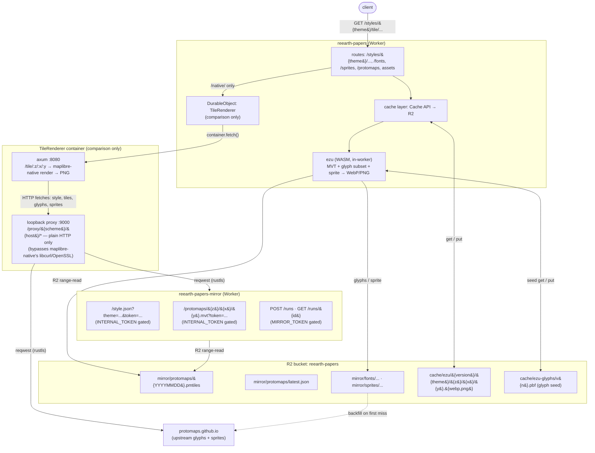

# Contributing

Everything a developer working on Re:Earth Papers needs to know:
architecture, local development, deploy, and the gotchas that cost us
a day to find the first time.

## Architecture


```mermaid
flowchart TD
  client([client])

  subgraph main["reearth-papers (Worker)"]
    direction TB
    main_routes["routes: /styles/&#123;theme&#125;/..., /fonts, /sprites, /protomaps, assets"]
    ezu["ezu (WASM, in-worker)<br/>MVT + glyph subset + sprite → WebP/PNG"]
    cache["cache layer: Cache API → R2"]
    do["DurableObject: TileRenderer<br/>(comparison only)"]
    main_routes --> cache --> ezu
    main_routes -->|"/native/ only"| do
  end

  subgraph container["TileRenderer container (comparison only)"]
    direction TB
    axum["axum :8080<br/>/tile/:z/:x/:y → maplibre-native render → PNG"]
    proxy["loopback proxy :9000<br/>/proxy/&#123;scheme&#125;/&#123;host&#125;/* — plain HTTP only<br/>(bypasses maplibre-native's libcurl/OpenSSL)"]
    axum -->|"HTTP fetches: style, tiles, glyphs, sprites"| proxy
  end

  subgraph mirror["reearth-papers-mirror (Worker)"]
    direction TB
    m_style["/style.json?theme=...&token=...<br/>(INTERNAL_TOKEN gated)"]
    m_v["/protomaps/&#123;z&#125;/&#123;x&#125;/&#123;y&#125;.mvt?token=...<br/>(INTERNAL_TOKEN gated)"]
    m_runs["POST /runs · GET /runs/&#123;id&#125;<br/>(MIRROR_TOKEN gated)"]
  end

  subgraph r2["R2 bucket: reearth-papers"]
    direction TB
    r2_archive["mirror/protomaps/&#123;YYYYMMDD&#125;.pmtiles"]
    r2_pointer["mirror/protomaps/latest.json"]
    r2_assets["mirror/fonts/... · mirror/sprites/..."]
    r2_cache["cache/ezu/&#123;version&#125;/&#123;theme&#125;/&#123;z&#125;/&#123;x&#125;/&#123;y&#125;.&#123;webp,png&#125;"]
    r2_seed["cache/ezu-glyphs/v&#123;n&#125;.pbf (glyph seed)"]
  end

  pubcdn["protomaps.github.io<br/>(upstream glyphs + sprites)"]

  client -->|"GET /styles/&#123;theme&#125;/tile/..."| main_routes
  do -->|"container.fetch()"| axum
  proxy -->|"reqwest (rustls)"| mirror
  proxy -->|"reqwest (rustls)"| pubcdn
  ezu -->|"R2 range-read"| r2_archive
  ezu -->|"glyphs / sprite"| r2_assets
  ezu <-->|"seed get / put"| r2_seed
  r2_assets -.->|"backfill on first miss"| pubcdn
  mirror -->|"R2 range-read"| r2_archive
  cache <-->|"get / put"| r2_cache
```

Two workers, one shared R2 bucket:

| Worker                      | Where                                         | Job                                                                                                                       |
|----------------------------|-----------------------------------------------|---------------------------------------------------------------------------------------------------------------------------|
| `reearth-papers`           | `papers.reearth.land` (custom domain)         | Public entry. Renders the themed rasters in-process with ezu, mirrors the glyph/sprite assets, owns the rendered-tile cache and the static preview page. Also hosts the comparison-only maplibre-native container. |
| `reearth-papers-mirror`    | `reearth-papers-mirror.reearth.workers.dev`   | Monthly Workflow that snapshots Protomaps' daily PMTiles into R2. Also serves the `/style.json` + `/protomaps/...` that the renderer container fetches from (gated by `INTERNAL_TOKEN`). |

The mirror duplicates `/style.json` (and `/protomaps`) on purpose. The
renderer container has to source those from somewhere; routing it
through the mirror's `workers.dev` hostname (rather than the main
worker's custom domain) gave us a cleaner debugging surface while we
were chasing the maplibre-native HTTP bug (see gotcha §1). Both
endpoints are gated by `INTERNAL_TOKEN` (a shared secret) so the
workers.dev hostname can't be abused as a free Protomaps tile CDN.

### Rendering

The themed rasters are rendered by [ezu](https://github.com/reearth/ezu),
a WASM renderer, inside the worker — no container hop. `src/ezu.ts`
owns the I/O ezu deliberately doesn't do:

- **MVTs** — the centre tile plus whatever neighbours the recipe asks
  for (`requestedNeighborOffsets`), because label collision reads
  across tile borders. Past the vector source's z15 each position
  resolves to its ancestor there and is bound with `sourceZoom`, which
  is how deep zooms get a crisp render instead of an upscaled bitmap.
  Pass the zoom of the tile you actually fetched, not the source's
  maxzoom — declaring one deeper than the tile being rendered throws.
- **Glyphs** — via `src/glyphs.ts`. `neededCodepoints()` names them
  individually; the 256-codepoint blocks `/fonts` serves are fetched,
  the wanted glyphs kept, the rest dropped, and a subset message bound
  per render. The store round-trips through one R2 object so a cold
  isolate starts from what previous ones learned to need.
- **Sprites** — through our own mirror (`src/sprites.ts`), so a cold
  isolate doesn't wait on GitHub Pages.

Renderer instances are retained per theme *and* CJK flavor, capped, and
concurrency-limited; `src/ezu.ts` carries the measured numbers behind
each constant. `x-ezu-heap`, `x-ezu-glyph` and `x-ezu-store` report what
the answering isolate is holding.

maplibre-native still runs, in the container, but only for
`/styles/{theme}/native/...` and the viewer's `?compare=ezu` mode.
Nothing routine reaches it, and its renders are edge-cached only — no R2
layer, since a permanent global copy of tiles nobody asks for isn't
worth paying for.

### Tile cache

Rendered raster tiles are cached in two layers (`src/render_cache.ts`):

1. **Cache API** (`caches.default`) — per-colo edge cache. Hot tiles
   are served from here without touching R2.
2. **R2** under `cache/ezu/...` — global, survives isolate recycles. On
   a Cache API miss we promote the R2 entry back into the edge cache.

The key is
`cache/ezu/{STYLE_VERSION*1000+EZU_RECIPE_VERSION}/{mirrorDate}/{theme}[-{cjk}]/{z}/{x}/{y}.{ext}`:

- **`STYLE_VERSION`** (`src/cache.ts`) — cartography. Bump it and every
  tile re-renders.
- **`EZU_RECIPE_VERSION`** (`src/ezu.ts`) — the committed recipes, and
  equally any renderer upgrade that moves pixels.
- **PMTiles mirror date**, from `mirror/protomaps/latest.json`. A render
  is only valid for the data behind it, so a fresh monthly snapshot
  rotates the whole namespace and the map actually updates.
- **CJK flavor**, derived from the coordinates (`src/cjk_flavor.ts`), so
  Han variants can't be served across regions.
- **Extension**, so the WebP and PNG encodings coexist rather than one
  serving the other's bytes.

Every one of those also has to reach the **edge** layer, which keys on
the request URL plus `?__v=` (`edgeCacheRequest` in
`src/render_cache.ts`). Tiles go out `immutable, max-age=1y`: an edge
entry that `__v` can't reach is an entry nothing can dislodge. If you add
a dimension to the R2 key, add it to `cacheVersion` in the same edit.

Old cache entries are not actively cleaned — they're simply unreachable,
so each snapshot leaves the previous month's renders behind. Two dead
namespaces to know about: `cache/tile/...` from the container era (~4.9
GB / 78k objects at the cutover) and whatever `cache/ezu/` generations
have rotated out. Both are dwarfed by `mirror/` — 596 of the bucket's
646 GB when last measured — so this is a tidiness question, not a cost
one. A lifecycle rule on `cache/` is the obvious answer if it ever
matters.

The mirror duplicates `/style.json` (and `/protomaps`) on purpose. The
renderer container has to source those from somewhere; routing it
through the mirror's `workers.dev` hostname (rather than the main
worker's custom domain) gave us a cleaner debugging surface while we
were chasing the maplibre-native HTTP bug (see gotcha §1). Both
endpoints are gated by `INTERNAL_TOKEN` (a shared secret) so the
workers.dev hostname can't be abused as a free Protomaps tile CDN.

## Repository layout

- `src/` — `reearth-papers` worker (TypeScript).
  - `index.ts` — route table + tile pipeline.
  - `ezu.ts` — the WASM renderer's host: recipes, MVT/sprite/glyph
    fetching, overzoom, per-isolate limits.
  - `glyphs.ts` — per-codepoint glyph store and subset PBF builder.
  - `sprites.ts` — mirrored Protomaps sprite sheets.
  - `fonts.ts` — mirrored glyph PBFs.
  - `cjk_flavor.ts` — region-priority Han variant selection.
  - `render_cache.ts` — Cache API + optional R2 layer for rendered tiles.
  - `cache.ts` — `STYLE_VERSION` (cartography version).
  - `paint_styles.ts` — the R2 shelf of ezu paint styles: manifest,
    documents, assets, and param validation.
  - `style.ts` — generated MapLibre style per theme.
  - `tilejson.ts` — TileJSON for raster + vector endpoints.
  - `pmtiles.ts` — R2-backed PMTiles vector tile reader.
- `public/` — static assets served via Workers Assets (preview page).
- `container/` — comparison renderer container (Rust + axum + maplibre-native).
  - `src/main.rs` — tile-server entry point.
  - `src/proxy.rs` — loopback HTTP proxy (the maplibre-native workaround).
  - `Dockerfile` — image build.
- `mirror/protomaps/` — `reearth-papers-mirror` worker (TypeScript).
- `scripts/deploy.sh` — deploy + container rollout wait.
- `wrangler.toml` — main worker config.

## Local development

Everything public renders in-worker (ezu), so `wrangler dev` is the
whole loop — no Docker needed for the paths that actually serve
traffic:

```bash
npm install
npx wrangler dev
curl 'http://localhost:8787/styles/protomaps-light/tile/0/0/0.webp' -o tile.webp
```

`.png` works on the same route if you want a lossless byte to diff;
`.webp` is what the TileJSON advertises and what clients get.

**For the viewer, pass `--local-upstream`.** With a `custom_domain`
route configured, `wrangler dev` rewrites the request host to that
route, so `new URL(request.url).origin` — which is what every TileJSON,
catalog link and tile template is built from — comes out as
`papers.reearth.land` even though you are on localhost. The page then
loads production, and anything not deployed yet 404s:

```bash
npm run dev:viewer      # wrangler dev --port 8787 --local-upstream localhost:8787
open http://localhost:8787
```

The viewer also pins its own fetches to the origin it was served from,
which covers the workers.dev hostname; the URLs *inside* a TileJSON can
only come from the worker, hence the flag.

### Paint styles

The paint styles (`/styles/paint-sumi/…` and friends) are ezu documents
published to an R2 shelf, which this worker reads at request time
(`src/paint_styles.ts`). Publishing one adds a tileset with no deploy
here — that is the point of the shelf, and it is why these documents are
not bundled the way the themed rasters' recipes are.

What this side relies on:

- `${PAINT_STYLES_PREFIX}/latest.json` — the manifest, written last so a
  half-uploaded revision is never a visible one. It carries each style's
  id, `rev`, display text, attribution, tile size, max zoom and params
  schema, so serving the catalog, a TileJSON or `params.json` is one
  memoised read.
- `{id}/{rev}/style.json` — the document as strict JSON (comments
  blanked on the way in, so no JSONC parser lives in the worker).
- `{id}/{rev}/assets/…` — the brushes and images the document names with
  `file:` paths.

`rev` is a content hash of the document plus its assets, and every cache
downstream keys on it, so publishing a change orphans exactly that
style's tiles. There is no version constant to bump.

A paint style has no `style.json`: an ezu document is a node graph, and
no MapLibre style means the same thing.

### Tuning a paint style (unreleased)

Each style declares its own parameters, and the tile route takes them:

```
/styles/paint-pencil-sketch/tile/12/3637/1612.webp?grain=0.9&paper=%23e8f0ff
```

`/styles/{id}/params.json` serves the schema ezu derives from the
document — types, defaults, ranges — and the viewer generates a panel
from it at **`/?params=1`**. Both are deliberately quiet: the
switch has no affordance in the UI and the catalog does not advertise the
schema, because this is here to demo rather than to ship. Making it a
feature is putting the `params` link back in the catalog entry
(`src/catalog.ts`).

Two things follow from that being a demo:

- **Tuned tiles are not persisted.** Every distinct set of knobs is its
  own cache namespace, so R2 would fill with pictures nobody asks for
  twice; they live in the per-PoP edge cache only. The default picture —
  what every client actually requests — still gets the global layer.
- Out-of-range or malformed values are refused with a 400 rather than
  clamped, so one URL cannot mean two pictures. Unknown query keys are
  ignored, because tile URLs collect cache-busters in the wild.

Only when you're touching the **comparison renderer** do you need the
container. Plain Docker is the fastest loop there — the image hash on
CF and local is identical, so behaviour matches end-to-end:

```bash
cd container
docker build --platform linux/amd64 -t papers-tile .
docker run --rm --platform linux/amd64 -p 8080:8080 \
  -e STYLE_URL=https://reearth-papers-mirror.reearth.workers.dev/style.json \
  papers-tile
curl 'http://localhost:8080/tile/0/0/0' -o tile.png
```

For the **worker → container chain** locally (needs Docker), drive the
comparison-only route:

```bash
npx wrangler dev
curl 'http://localhost:8787/styles/protomaps-light/native/0/0/0.png' -o tile.png
```

For the **mirror worker** locally:

```bash
cd mirror/protomaps
npm install
npx wrangler dev
```

When you're investigating CF-side behaviour and want the *exact* image
CF is currently running, pull from the managed registry:

```bash
APP_ID=$(npx wrangler containers list | grep reearth-papers-tilerenderer | awk -F'│' '{print $2}' | tr -d ' ')
IMG=$(npx wrangler containers info $APP_ID | jq -r '.configuration.image')
docker pull --platform linux/amd64 "$IMG"
docker run --rm --platform linux/amd64 -p 8081:8080 -e STYLE_URL=... "$IMG"
```

## Deploying

```bash
# Main worker + renderer container (with container rollout wait).
bash scripts/deploy.sh

# Mirror worker.
cd mirror/protomaps && npm run deploy
```

CI (`.github/workflows/ci.yml`) runs typecheck and
`wrangler deploy --dry-run` for each worker on every push, plus a
Docker build of the renderer. `.github/workflows/deploy.yml` runs the
deploy script automatically on pushes to `main`.

The mirror worker is also triggered monthly by cron
(`0 7 1 * *` UTC) — see `mirror/protomaps/wrangler.toml`. Manual runs
are available via `POST /runs` with a bearer token
(`wrangler secret put MIRROR_TOKEN`).

## Gotchas

### 1. maplibre-native HTTP crashes inside CF Workers Containers

The single most painful thing to learn.

maplibre-native's built-in HTTP file source (`libcurl` + OpenSSL on
Linux) fails on every HTTPS request from inside a CF Workers Container
with `SSL_connect: SSL_ERROR_SYSCALL` or `Failure when receiving data
from the peer`, and the C++ side then `std::terminate`s — taking the
whole process down before the Rust panic hook can log anything.

Confirmed by elimination:
- `reqwest` (rustls) from the same container → 200.
- `/usr/bin/curl` (Ubuntu's libcurl over OpenSSL) from the same
  container → 200.
- The exact same image under plain Docker → renders cleanly.
- A sibling container app on the same CF account doing 85 parallel
  libcurl-multi HTTPS GETs to the same upstream → 0 failures.

So: maplibre-native's specific use of libcurl is what trips a
Workers-Containers-side issue we can't reach from outside.

**Workaround in this repo** (`container/src/proxy.rs`):

1. The container spawns a localhost HTTP server on `127.0.0.1:9000`
   that accepts `GET /proxy/{scheme}/{host}/{*path}` and uses
   `reqwest` to fetch the real upstream.
2. After downloading `style.json`, the container parses it and
   rewrites `tiles[]` / `url` / `glyphs` / `sprite` URLs to point at
   the loopback proxy.
3. maplibre-native sees plain-HTTP localhost URLs, never reaches its
   broken TLS path, and renders without crashing.

**Do not undo this.** If you swap the proxy out (e.g. "let's just use
real URLs now"), you'll get a silent crash in production with no
clear log message — which is exactly the loop we spent a day in.

If maplibre-native ships a fix or a way to override its file source
from Rust, the proxy is what should go away.

### 2. Don't `wrangler containers delete` + recreate to debug

When a container instance looks stuck (`inactive` after a request, no
logs), the instinct is to delete the container app and redeploy. We
did that ~5 times. None of it helped, and each cycle cost a ~10 minute
docker rebuild.

`wrangler deploy` overwrites the existing container app in place. The
running image is identified by hash; if the image content changes,
the new SHA gets a new tag automatically. Use that, and check the CF
dashboard's container logs view for diagnostics instead of resetting
state.

### 3. Renaming a worker is not free

Renaming `name = "..."` in `wrangler.toml`:
- Creates a *new* Worker, leaves the old one orphaned (must be
  deleted explicitly with `wrangler delete --name old-name`).
- Renames the container app from `<old-name>-<class>` to `<new-name>-<class>`.
  CF treats this as creating a new app.
- Resets DO state (namespace ID changes).
- Custom domains follow the new Worker, but allow a couple of minutes
  for routes to fully attach.

Multi-pass renames (rename → break → rename back) bake DO migration
history into CF that you can't easily roll back. If you've already
deployed `v1: new_sqlite_classes=["X"]`, you cannot delete that and
redeploy `v1: new_sqlite_classes=["Y"]` against the same worker.
You can:
- Add a `v2` migration with `renamed_classes` or `deleted_classes`, or
- `wrangler delete` the worker entirely and start fresh.

The cleanest reset is the `wrangler delete` route. If you go that way,
remember to re-attach secrets afterwards (`wrangler secret put ...`).

### 4. Nested style URLs need URL encoding

`?style=` is the **container's** query parameter, not a public one — the
worker builds that inner URL itself (`renderNativeTile` in
`src/index.ts`), so this only bites when you drive a container directly:

```bash
# WRONG — the inner `?` ends the outer query
curl 'http://localhost:8080/tile/0/0/0?style=https://x/style.json?theme=dark'

# RIGHT — encode the inner URL
curl 'http://localhost:8080/tile/0/0/0?style=https%3A%2F%2Fx%2Fstyle.json%3Ftheme%3Ddark'
```

The container's axum router silently treats the unencoded form as a
truncated style URL and renders an empty tile (or hangs while loading
"https://x/style.json" — note the missing `?theme=`).

### 5. Mirror PMTiles are huge; deletes are not

A single Protomaps daily build is ~135 GB. The mirror worker's
`RETAIN_VERSIONS = "2"` cap is what keeps R2 usage from accumulating
forever — if you crank it up, do the multiplication first.

Re-running the mirror manually (`POST /runs`) before the previous
month's archive has aged out is fine; the workflow deletes only
*older* archives after the new one completes.

### 6. Headless rendering: Vulkan (lavapipe), not Xvfb + OpenGL

A maplibre-native renderer on Linux can be wired up two ways:

- **OpenGL through Xvfb + GLFW + llvmpipe.** Needs an X server inside
  the container, a virtual framebuffer, and a Mesa GL software path.
  The image bloats to ~350 MB and the entrypoint has to start Xvfb
  before the binary.
- **Vulkan + lavapipe (Mesa's CPU Vulkan ICD).** Surfaceless rendering
  is native to Vulkan; no windowing system needed. Image stays around
  ~150 MB and there's no entrypoint script.

We use Vulkan. The relevant moving pieces:

- `Cargo.toml`: `maplibre_native = { version = "=0.4.6", features = ["pool", "vulkan"] }`
- `Dockerfile` runtime stage: installs `libvulkan1 mesa-vulkan-drivers`
  and pins the Vulkan loader to lavapipe via
  `VK_ICD_FILENAMES=/usr/share/vulkan/icd.d/lvp_icd.json`. All other
  GPU ICDs (intel/radeon/nouveau/asahi/virtio/gfxstream — ~84 MB
  combined) and their `.so` files are deleted to keep the image lean.

Two non-obvious traps in this setup:

1. **The Dockerfile still installs X11 / GLFW / EGL dev libs in the
   *builder* stage** (`libx11-dev libglfw3-dev libgl1-mesa-dev
   libegl1-mesa-dev`). That's because maplibre-native's Linux CMake
   unconditionally builds *both* the Vulkan and OpenGL/GLFW platform
   layers regardless of which Rust feature is selected. CMake needs
   the link-time symbols to resolve; nothing actually executes them
   at runtime. Don't remove them from the builder stage thinking
   they're dead weight.
2. **`libx11-6` has to stay in the *runtime* stage too**, even though
   Vulkan never touches it at runtime — `libmaplibre.so` is link-time
   tied to libX11, so `dlopen` fails without it present. It's about
   1 MB; just leave it.

If you ever want to swap back to the OpenGL path (e.g. to debug a
Vulkan-specific issue), you'd need to reintroduce Xvfb + an entrypoint
script and switch the maplibre_native feature flag from `vulkan` to
the default. Worth knowing exists; do not actually undertake unless
you have a strong reason.

### 7. Container logs in the CF dashboard can drop your messages

We saw periods where stdout/stderr from inside the container did not
appear in the dashboard logs view, even though the container was
clearly running (verified by network-side phone-home traces). When
that happens, two things help:

1. Make outbound HTTP calls early in `main()` so you have an external
   witness. Even a 404 from a known worker is enough.
2. Use the CF dashboard's "Container" tab on the Worker page, not
   "Workers" — the latter shows worker invocations, not container
   stdout. They're related but separate streams.

### 8. A promise only another request can settle is not awaitable

Limiting concurrency across requests looks like a resolver queue:

```js
// WRONG — workerd cancels the waiter
const waiters = [];
await new Promise((resolve) => waiters.push(resolve));   // another request resolves this
```

workerd sees a request with no pending I/O of its own and kills it:
*"The Workers runtime canceled this request because it detected that
your Worker's code had hung and would never generate a response."* We hit
this on the first attempt at ezu's render permit — 8 of 12 concurrent
requests died. Global mutable state is fine; the *handover* is not.

Poll instead, so the waiter owns real I/O:

```js
while (active >= MAX && Date.now() < deadline) {
  await new Promise((r) => setTimeout(r, 10));
}
active++;   // no await between the check and the increment, so it's atomic here
```

A promise chain backed by another request's in-flight I/O (ezu's
per-state `lock`) does work — it's the bare resolver handover that
doesn't.

## Other notes

- `package-lock.json` is committed. `npm ci` in CI; `npm install` for
  local work.
- `worker-configuration.d.ts` is `wrangler types`–generated. Re-run
  `npx wrangler types` after editing `wrangler.toml`.
